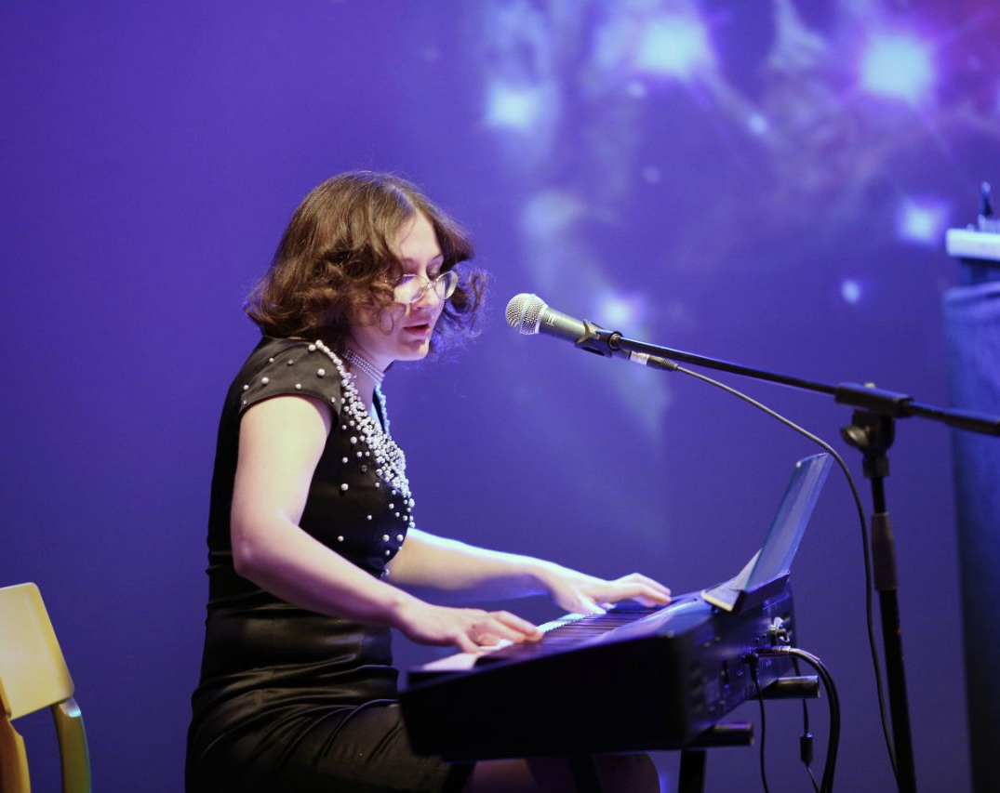

# Наташа Блинова
_for english version please scroll down a bit_

Наташа Блинова – певица, композитор, пианист, исполнитель на мелодионе и фронтвумэн **Ансамбля Прёт**.

Её музыкальная карьера началась в Пензе. Когда она была тинейджером, ей удалось выиграть несколько конкурсов и фестивалей Юных талантов. Затем она перебралась в Москву, где закончила *Академию им.Гнесиных.* В Москве она начала активно работать на импровизационной, экспериментальной и джазовой сценах, а также её голос можно услышать на множестве студийных и концертных записей. Также она преподает вокал, джаз- и поп-гармонию, дает ансамблевые мастер-классы, при этом сама не перестаёт неустанно учиться и открывать новые музыкальные территории.

Обладая ярким и проникновенным голосом и чувствуя себя на сцене легко и непринуждённо, она чувствует себя одинаково свободно исполняя музыку своего собственного сочинения, в джазовом контексте, и в живой импровизационной музыке. 

Интересно проследить, как менялись её музыкальные интересы: начав в качестве лид-вокалиста  и автора песен для студенческой арт-рок группы *Кали-Юга,* Наташа затем стала участником фри джаз коллектива Алексея Круглова *Круглый Бенд,* после чего она появилась в Польше на фестивале Джазовая осень в Бельска – Бяла; это было в 2004-м году с *Секстетом Алексея Чернакова (New Jazz Generation z Rosji).* Секстет исполнял композиторскую джазовую музыку, основанную на наследии великих советских композиторов. Вернувшись в Москву, Наташа сформировала **Ансамбль Прёт**, как средство для выражения широкого спектра её идей. С этим коллективом она стала лауреатом первого конкурса *Усадьба.Джаз.*

Наташа Блинова выступала и принимала участие в записи альбомов большого количества русских и международных артистов и коллективов: *Анхель Онтальва против Дуэта Прёт* (Испания – Россия), *Ален Блесин и друзья* (Франция – Россия), *Радио Восток, Сахра, Трио Прёт, Дуэт Прёт, Ансамбль Живые люди, Московский Violinjazz Квартет,* и других. Наташа участвовала в конкурсе *Voicingers,* который проходил в Польше в 2016 году.

Чтобы познакомиться с творчеством Наташи в полной мере, послушайте альбом [**Ансамбля Прёт *Настоящее***, вышедший на лейбле *FANCYMUSIC* и доступный на всех стриминговых платформах.](https://fancymusic.ru/priot-ensemble-present-continuous/) Чтобы лучше узнать джазовую сторону творчества Наташи, можно послушать альбом *Blue Priot* (веб – релиз), состоящий из джазовых стандартов.

# Natasha Blinova

Natasha Blinova is Moscow-based singer, composer, pianist, melodion performer, and a frontwoman of **Priot Ensemble.**

Her career in music was started in Penza City. As a teenager, she became a winner of several competitions and festivals for young talents. Then she moves to Moscow to study in and then graduate from *Gnessin Academy.* In Moscow she starts to work on improvisational, experimental and jazz scenes as a prolific artist, also we have a lots of studio and live recordings. Also, she giving vocal, jazz and pop harmony lessons, ensemble workshops, while keeping exploring new musical territories.

Фото: Александра Картавая (?)

Gifted with bright and insightful voice and feeling herself on the stage so naturally, she feels equally freely either performing music of her own composition, in jazz context, or performing conceptual improvisational music. It's interesting to see how her interests in music has evolving: starting as a lead vocalist and a singer-songwriter for a student art-rock band *Kali Yuga,* Natasha then becomes a member of Alexey Kruglov's free jazz unit *Krugly Band,* after that she's arriving in Poland in 2004 at the *Jazzowa Jesień w Bielsku-Białej* festival with *The New Jazz Generation z Rosji (Alexey Chernakov Sextet)* to perform a conceptual jazz music based on a great Soviet composers' heritage, and then she formed ***Priot Ensemble*** in Moscow to express her own ideas.  Soon after that she won prestigious Laureate award of first *Usadba.Jazz* competition with that band.

Natasha Blinova performs with numerous Russian and international artists and bands, such as *Ángel Ontalva VS Priot Duo* (Spain – Russia), *Alain Blesing and Friends* (France – Russia), *Radio Vostok, Sakhra, Priot Trio, Priot Duo, Live People Ensemble, Moscow Violinjazz Quartet* and others. Natasha was a participant of *Voicingers* jazz competition (Poland) in 2016.

To listen in full swing to what Natasha doing in music, we can reach out and listen to [Priot Ensemble's Present Continuous album on all streaming platforms (FANCYMUSIC release).](https://fancymusic.ru/priot-ensemble-present-continuous/) And to know Natalia's jazz side better we can listen to *Blue Priot* album (web release only), it consists of jazz standards only and soon will be freely available on the band's official website https://priot.ru .

